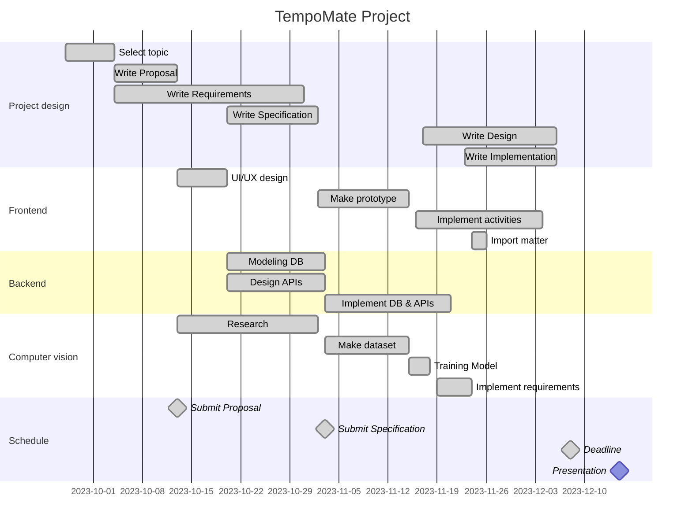

#

### Demo video

## Proposal
[Document](https://github.com/se-tmp/document/releases)

With the growing interest in home automation, we propose research to improve the user experience. Current methods, like voice
commands and motion sensors, have limitations that necessitate specific requests or unusual actions from users. To address this, our research aims to create a more intuitive system. 

We will develop a service using the Matter protocol, a technology for managing smart devices, that enables users to trigger actions through natural behavior, such as gestures. Cameras connected to the system will employ posture recognition to identify user actions, like sitting, standing, or lying down. By recognizing user posture and their interactions with objects,
the system will automatically perform predefined actions.

This project empowers users to define actions based on their daily activities, making home automation more user-friendly. The research's primary goals are to develop a user-centric system that accurately understands user intentions and offers a more seamless and intuitive home automation experience

최근 스마트 홈에 대한 관심이 높아짐에 따라, 여러 기업들은 연결된 기기를 통합적으로 간편하게 제어하기 위한 방법을 연구하고 있습니다. 현재는 음성으로 서비스를 호출하여 특정 액션을 요청한다던지, 특정 센서에 움직임이 감지되면 특정 액션이 트리거되는 등의 방법이 존재합니다. 

그러나 이러한 방법들에는 한계가 존재합니다. 사용자에게 기기를 제어하기 위해서가 아니라면 하지 않았을, 특정한 호출이나 동작을 강제합니다. 이는 사용자가 무엇을 위해 이 동작을 의도했는지 알 수 없다는 점도 있습니다. 이러한 한계는 자연스럽게 내 의도를 파악하여 그에 맞는 행동을 하는 스마트 홈을 구축하길 원하는 사용자들의 니즈를 충족시킬 수 없습니다.

그래서 우리는 사용자들이 부자연스럽지 않은, 의도가 담긴 자연스러운 동작을 통해 특정 액션을 실행할 수 있는 플랫폼을 제안합니다. 

이 플랫폼은 Matter 프로토콜을 이용해 기기들을 통합하고, 관리할 수 있는 플랫폼을 제공합니다. 이 플랫폼에서, 유저는 어느 위치의 어떤 사물에서 어떤 동작을 취하는지에 따라 어떤 액션이 실행될 지를 설정할 수 있습니다. 이 플랫폼에 연결된 카메라를 이용해, 이 플랫폼은 유저의 위치와 자세를 추정합니다. 이런 방법으로 지정된 사물에서 설정해놓은 자세를 취하는 것을 인식하면 미리 지정된 액션을 실행합니다. 이 플랫폼을 이용해 유저는 기존의 홈 오토메이션보다 한 단계 앞서 작동하고, 유저의 의도를 더욱 더 잘 파악하여 동작하는 홈 오토메이션을 완성할 수 있습니다.

# Architecture

## Group Member

| NAME | DEPT. | E-mail |
|------------|------|------|
| Kwon JongIn  | Information Systems   | whddlswhdaud@naver.com   |
| Bae HyoJung  | Information Systems   | bhj09270@hanyang.ac.kr   |
| Jo Taesik    | Information Systems   | r4pidstart@hanyang.ac.kr   |
| Lee HyunSuk  | Information Systems   | leehyunsuk2000@gmail.com   |
| Nam Haixu    | Information Systems   | what-is-my-id@naver.com   |

---

