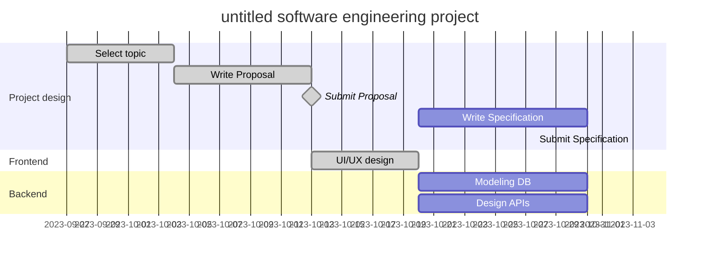

# HOME AUTOMATION

2023 한양대학교 소프트웨어공학 프로젝트

[go to document](https://github.com/se-tmp/document/releases)

## Proposal

With the growing interest in home automation, we propose research to improve the user experience. Current methods, like voice
commands and motion sensors, have limitations that necessitate specific requests or unusual actions from users. To address this, our research aims to create a more intuitive system. 

We will develop a service using the Matter protocol, a technology for managing smart devices, that enables users to trigger actions through natural behavior, such as gestures. Cameras connected to the system will employ posture recognition to identify user actions, like sitting, standing, or lying down. By recognizing user posture and their interactions with objects,
the system will automatically perform predefined actions.

This project empowers users to define actions based on their daily activities, making home automation more user-friendly. The research's primary goals are to develop a user-centric system that accurately understands user intentions and offers a more seamless and intuitive home automation experience

## Group Member

| NAME | DEPT. | E-mail |
|------------|------|------|
| Kwon JongIn  | Information Systems   | whddlswhdaud@naver.com   |
| Bae HyoJung  | Information Systems   | bhj09270@hanyang.ac.kr   |
| Jo Taesik    | Information Systems   | r4pidstart@hanyang.ac.kr   |
| Lee HyunSuk  | Information Systems   | leehyunsuk2000@gmail.com   |
| Nam Haixu    | Information Systems   | what-is-my-id@naver.com   |

